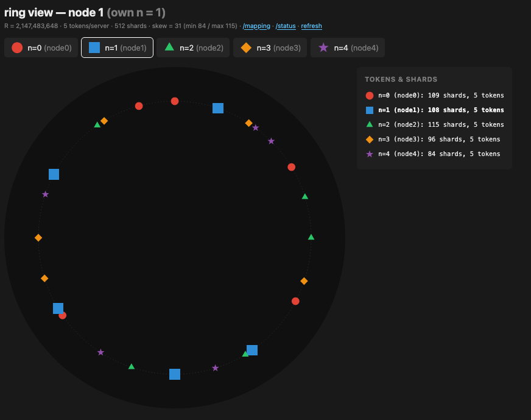

# kropotkin — deterministic consistent hashing with gossip failure detection



## Mapping algorithm

A consistent-hashing token placement scheme using the [van der Corput (VdC) sequence](https://en.wikipedia.org/wiki/Van_der_Corput_sequence) instead of random positions. (No claim is made that this is better than some deterministic pseudo-random sequence. Indeed the example above shows adjacent tokens belonging to the same node for three of the nodes in the ring. The code allows different sequences to be plugged in.)

The naive approach — assigning each server a consecutive block of VdC values — is pathological: because consecutive VdC blocks are exact ring-translates of one another, all of a failed server's positions share the same clockwise successor, collapsing failover load onto a single node regardless of token count.

The fix (suggested by Claude!): assign tokens by residue class mod `S` (where `gcd(S, base) = 1`). Server `N` owns positions `{ vdc(N + tS) : t = 0, …, T−1 }`. This preserves the low-discrepancy property per server while breaking the translation coupling. See [vdc-consistent-hashing.md](vdc-consistent-hashing.md) for the full derivation.

Inspired by <!-- TODO: Rocksteady/VDC paper ref --> applied to consistent hash rings. The only state each node needs to communicate is its residue class mod `S`.

**Design parameters**

| param | role | default |
|-------|------|---------|
| `R` | ring size — VdC floats are mapped to integers in `[0, R)` | `2^31` |
| `shards` | number of equal-sized buckets the ring is divided into for shard-to-server assignment | `512` |
| `T` | tokens per server | `5` |
| `b` | VdC base | `2` (bit-reversal); must satisfy `gcd(b, S) = 1` |
| `S` | stride / residue class count | `100069`; must satisfy `S > N_max`, `gcd(S, b) = 1` |
| `N` | server identity | any free slot in `{0, …, S−1}`, claimed at join |

## Gossip protocol

Implements the SWIM-based failure detector from [Gupta et al. (2001)](#refs): direct probes with indirect probe-requests (`ping_req`) when a direct ping times out, two-phase ALIVE → SUSPECT → DEAD state machine. There is an additional JOINING state when a node joins the cluster but not yet claimed a slot.

## Docker compose

```bash
docker compose up --build
```

Five nodes start on ports 9000–9004. Tune failure detection via env vars in `docker-compose.yml`:

| var | default | effect |
|-----|---------|--------|
| `PING_TIMEOUT` | `1.0` | seconds before a probe is considered failed |
| `SUSPICION_TIMEOUT` | `2.0` | seconds in SUSPECT before marking DEAD |

Kill a container to watch failure detection propagate:

```bash
docker compose stop node2
```

## Refs

- <a name="refs"></a>[Gupta, Chandra, Lancia — "On Scalable and Efficient Distributed Failure Detectors" (PODC 2001)](https://dl.acm.org/doi/10.1145/383962.384020)
- [DeCandia et al. — "Dynamo: Amazon's Highly Available Key-value Store" (SOSP 2007)](https://www.allthingsdistributed.com/files/amazon-dynamo-sosp2007.pdf)
- [Karger et al. — "Consistent Hashing and Random Trees" (STOC 1997)](https://dl.acm.org/doi/10.1145/258533.258660)
- [Google — "Reinventing Backend Subsetting at Google" (ACM Queue 2022)](https://queue.acm.org/detail.cfm?id=3570937)
